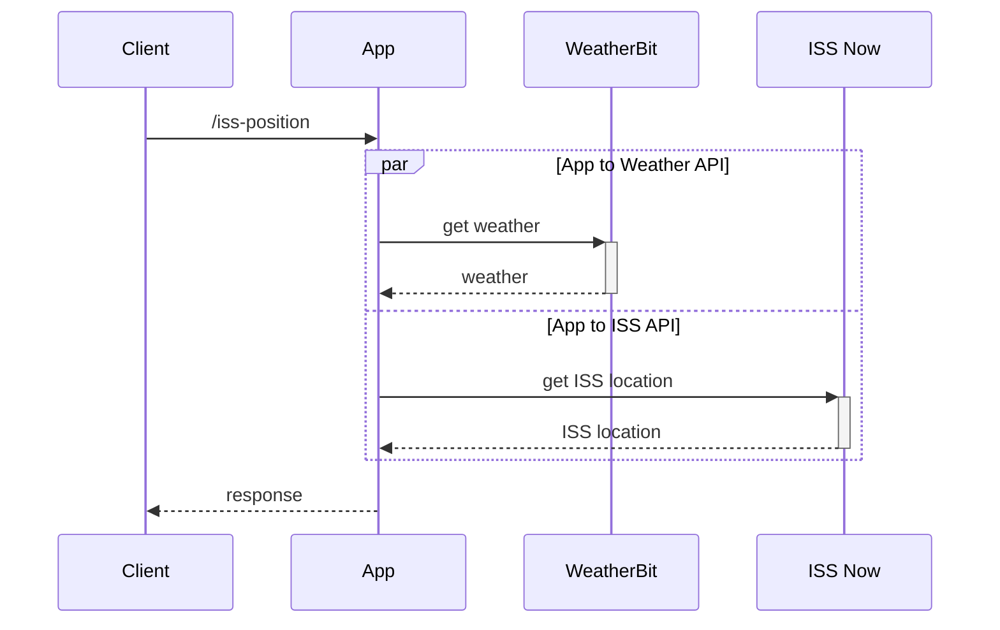

# the-starry-night

REST api written in golang that indicates whether the ISS is visible overhead

### Build

1. To build executable run `make` from the root directory
1. To run the compiled binary run `./main`

An api key from [weatherbit.io](https://www.weatherbit.io/api) is necessary to run this application.

This API key should **must** be configured using an environment variable `WEATHER_BIT_API_KEY`

For local development & convenience you can create a `settings_private.yaml` to store the api key,
to create the file run `make create-settings-private`

This file is in the gitignore and should not be committed

|                                          | command                                        |
| ---------------------------------------- | ---------------------------------------------- |
| Build then run app                       | `WEATHER_BIT_API_KEY=your-api-key; make start` |
| Watch files then auto-compile then start | `WEATHER_BIT_API_KEY=your-api-key; make dev`   |

### Configuration

The default values are loaded from `settings.yaml` and can be overridden by environment variables

| Description                                                         | ENV VARIABLE                  | DEFAULT VALUE                             | Required |
| ------------------------------------------------------------------- | ----------------------------- | ----------------------------------------- | -------- |
| Port that application listen on                                     | `SERVER_PORT`                 | `8080`                                    |          |
| Logging level, options are "DEBUG", "INFO", "WARN" & "ERROR"        | `LOG_LEVEL`                   | `INFO`                                    |          |
| ISS Rest API URL                                                    | `ISS_API_URL`                 | `http://api.open-notify.org/iss-now.json` |          |
| Weatherbit Rest API key                                             | `WEATHER_BIT_API_KEY`:        | _none_                                    | yes      |
| Weatherbit Rest API base URL                                        | `WEATHER_BIT_API_BASE_URL`:   | `https://api.weatherbit.io/v2.0`          |          |
| Threshold value over which visibility is considered possible        | `CLOUD_COVER_THRESHOLD`       | 30                                        |          |
| How many decimal places of accuracy to use to consider ISS overhead | `ACCURACY_NUM_DECIMAL_PLACES` | 4                                         |          |

# Prerequisites

| Dependency       | Installation                                                                |     |
| ---------------- | --------------------------------------------------------------------------- | --- |
| go (min `v1.17`) |                                                                             |     |
| go-swagger       | [installation](https://goswagger.io/install.html)                           |     |
| golangci-lint    | [installation](https://golangci-lint.run/usage/install/#local-installation) |     |
| air              | run: `go install github.com/cosmtrek/air@latest`                            | \*  |
| richgo           | run: `go install github.com/kyoh86/richgo@v0.3.10`                          | \*  |

To check if you have the required dependencies installed run `make check.dependencies`

To set up git hooks run `make setup-git-hooks`

# Tests

- To run unit tests run `make test`
- To run integration tests run `make test.integration` (ensure the app is running before running integration tests)

# API documentation

Rest API documentation is auto-generated by go-swagger

- Run `make swagger.scan` to generate docs
- The swagger docs are hosted by the application at `/swagger-ui/` e.g. http://localhost:8080/swagger-ui/ with default port
